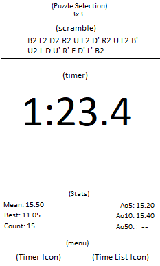
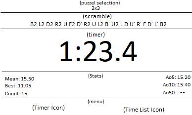
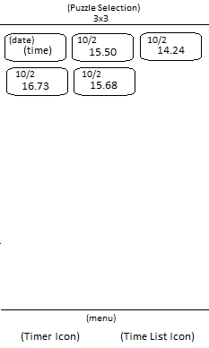
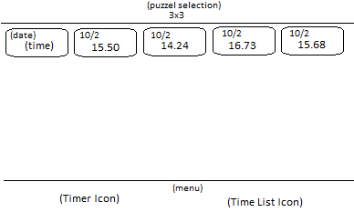

= CSCI-C490 Project - CubeTimer

== Motivation
The app I will be creating will be a timer for Rubik's Cube type puzzles (just NxNxN puzzles to begin with), with the target audience of speedcubers.

This app is inspired by, and will be based on the app https://play.google.com/store/apps/details?id=com.aricneto.twistytimer&hl=en_US["Twisty Timer"]. As far as I am aware, the app is only available on Android, but there is a similar (but not free) app on iOS called https://apps.apple.com/us/app/byte-timer-twisty-timer/id1435909416["Byte Timer"]

== User Interface

There will be two main screens in the app: the timer and the time list.

=== Timer
This is the main screen of the app, and is where most of the functionality will be.

This screen will be divided into 5 subsections: 

* Puzzle selector
** Menu to select which puzzle you want to solve.
* Scramble
** Randomly generated scramble (via web API) for the puzzle selected above.
* Timer
** Times the current solve.
* Stats
** Displays the following statistics for the selected puzzle: 
*** Mean -- Drop the highest and lowest and average the rest
*** Best -- Fastest solve
*** Count -- Total number of solves
*** Ao5 -- Average of the last 5 solves ("--" until there are at least 5 solves)
*** Ao10 -- Average of the last 10 solves ("--" until there are at least 10 solves)
*** Ao50 -- Average of the last 50 solves ("--" until there are at least 50 solves)
* Menu
** Controls to switch between timer and time list screens (for the selected puzzle).

==== Layouts

.Timer screen (portrait)
[caption="Figure 1: "]

[.clearfix]
.Timer screen (landscape)
[caption="Figure 2: "]

=== Time List
This screen will display a history of all the user's solves for the selected puzzle. From here the user will be able to do things like see/delete times and (_possibly_) the ability to see the associated scramble and add a comment.

==== Layouts
.Time list screen (portrait)
[caption="Figure 1: "]

[.clearfix]
.Time list screen (landscape)
[caption="Figure 2: "]

== Data Persistence
Data will be stored in the device's SQLite database using Room.

Data will be divided into two categories:

* User settings
** Selected puzzle
** Show inspection*
** Inspection time*
* Times
** Solve time (milliseconds)
** Solve date
** Puzzle type
** Scramble**
** Comment**

*Will only be added if I have time to implement the inspection feature

**Will be added if I have time

== Communication
This app will communicate with the outside world by getting its scrambles from an outside API https://scrambler-api.herokuapp.com/3x3x3. This is a very simple REST API that returns a JSON array with a random scramble for a given puzzle. I did not create this API, I simply stumbled across it on a cubing forum. If I end up continuing the development of this app after class I will make my own REST API or bake the scrambler directly into the app. But for now it suits my purposes.

= MVC Breakdown
This app will consist of only one activity (MainActivity). This activity will have a couple of static parts (Puzzle Selector and Menu) as well as several Fragments that are dynamically loaded/unloaded (TimerFragment and TimesListFragment).

* onCreate loads TimerFragment

== Puzzle Selector
* Will be essentially just a Spinner that allows the user to select from the list of available puzzles.
** Undecided on wether available puzzle will be hard coded in or loaded dynamically.
* Once a puzzle has been selected it will be saved to the view model (MainActivityViewModel) and to the Room Database.
** onCreate will pull from the database to set the selected puzzle to whatever the last selected puzzle was (default to 3x3).

== Menu
* Consists of two items (probably represented by icons) Timer and Times List. 
** Timer (default)
*** Loads the TimerFragment and unloads the TimesListFragment when clicked
** Times List
*** Loads the TimesListFragment and unloads the TimerFragment
* Selected item is stored in the MainActivityViewModel (for preservation on rotation)

== TimerFragment
Contains the following 3 parts:

=== Scramble
* Shows a scramble for the selected puzzle
* Fetches the appropriate scramble from the web API
** Scramble will be updated when the puzzle selection changes
* Saves scramble to its own ViewModel (TimerViewModel) to prevent loss on rotation
* Possible features:
** Save scramble to database with the corresponding solve time
** Add click event to fetch a new scramble

=== Timer
* Times the users solves down to a millisecond (0.01 sec)
** Timer starts when the user clicks on the timer display
*** If I have time/can figure it out, this may change to the user pressing and holding the timer display for a second
** Timer stops when the user clicks the timer display a second time
*** Stopping the timer will save the final time to the Room database
* Current time will be will be updated in the ViewModel (TimerViewModel) in real time (to prevent the time from being lost on rotation)
** Time will be saved as milliseconds and converted to the display format (mm:ss.SS)
*** Time will be converted from milliseconds either using a util function, either built in or custom
* If the inspection feature is implemented/enabled:
** First click on timer display will start inspection count down
** Second click will start the timer, if the inspection is still going, else it will stop the timer
** Third click will stop the timer, if the timer was started mid-inspection

=== Stats
* Displays various statistics about the users solve times (see <<Timer, User Interface>> section)
* onCreate (TimerFragment) loads initial array of solve times to use for calculations
** Later solves are added directly to this array when a solve is finished
** Array is refreshed when the puzzle selection changes
* Stats are updated after every solve

== TimesListFragment
* Loads a list of all the solves for the selected puzzle from the Room database
* Allows the user to delete a solve
** User will press and hold a solve for a second at which point a delete icon will appear at the top of the screen, below the puzzle selection
* May add other features such as:
** The ability to edit solve times/penalties
** The ability to view the solve scramble
** The ability to see/edit a comment on the solve